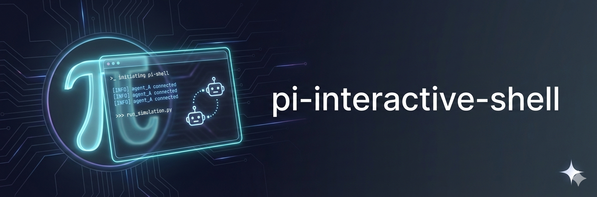

<p>
  
</p>

# Pi Interactive Kitty

An extension for [Pi coding agent](https://github.com/badlogic/pi-mono/) that lets Pi autonomously run interactive CLIs in managed kitty tabs. Pi can monitor and control the subprocess while you watch or type directly.

This is a fork of [nicobailon/pi-interactive-shell](https://github.com/nicobailon/pi-interactive-shell), renamed and reworked for a kitty remote-control backend.

https://github.com/user-attachments/assets/76f56ecd-fc12-4d92-a01e-e6ae9ba65ff4

```typescript
interactive_shell({ command: "vim config.yaml" });
```

Important: the `interactive_shell({...})` snippets in this README are tool calls made by Pi (or extension/prompt authors). End users do not type these directly into chat. As a user, ask Pi to run something (for example: "run this in dispatch mode") or use `/spawn`, `/attach`, and `/dismiss` commands.

## Why

Some tasks need interactive CLIs - editors, REPLs, database shells, long-running processes. Pi can launch them in a kitty tab where:

- **User watches** - See exactly what's happening in real-time
- **User takes over** - Type anything to gain control
- **Agent monitors** - Query status, send input, decide when done

Works with any CLI: `vim`, `htop`, `psql`, `ssh`, `docker logs -f`, `npm run dev`, `git rebase -i`, etc.

## Install

```bash
pi install npm:pi-interactive-kitty
```

The `pi-interactive-kitty` skill is automatically symlinked to `~/.pi/agent/skills/pi-interactive-kitty/`.

**Requires:** Node.js. Requires kitty with remote control enabled via `KITTY_LISTEN_ON` or `kitty.listenOn`.

## Modes

| Mode                      | Agent waits?            | How output reaches agent                          | Best for                                                                            |
| ------------------------- | ----------------------- | ------------------------------------------------- | ----------------------------------------------------------------------------------- |
| **Interactive** (default) | Yes — blocks until exit | Tool return value                                 | Editors, REPLs, SSH — when you need the result now                                  |
| **Hands-free**            | No                      | Poll with `sessionId`                             | Dev servers, builds — when you want to watch progress and send follow-up commands   |
| **Dispatch**              | No                      | Notification on completion via `triggerTurn`      | Delegating tasks to subagents — fire and forget                                     |
| **Monitor**               | No                      | Notification on structured monitor trigger events | Watchers, logs, tests, and state checks — wake only when something specific happens |

**Interactive** — The kitty tab opens, user controls the session, agent waits for it to close. Use for editors (`vim`), database shells (`psql`), or any task where the agent needs the final result immediately.

**Hands-free** — The kitty tab opens but returns immediately. The agent polls periodically with `sessionId` to check status and get new output. Good for long-running builds or dev servers where you want to react mid-flight (send input, check logs, kill when ready).

**Dispatch** — Returns immediately. No polling. The agent gets woken up via `triggerTurn` only when the session completes (natural exit, timeout, quiet detection, or user kill). The notification includes a tail of the output. This is the default for delegating work to subagents. Add `background: true` to avoid focusing the new kitty tab.

**Monitor** — Returns immediately. No polling, no completion notification. The agent gets woken up when a configured monitor trigger emits an event. Supports stream triggers, poll-diff checks, first-class file watching, optional cooldowns, persistence controls, detector commands, and event history queries. Runs in managed kitty; attach to inspect if needed.

## Quick Start

The examples below show agent-side tool calls. They are not chat commands for end users.

### Structured Spawn

For Pi, Codex, Claude, and Cursor, the agent can use structured spawn params instead of building command strings by hand:

```typescript
// User says: "Spawn pi so I can edit files interactively"
interactive_shell({ spawn: { agent: "pi" }, mode: "interactive" });

// User says: "Delegate this refactor to codex and notify me when it's done"
interactive_shell({ spawn: { agent: "codex" }, mode: "dispatch" });

// User says: "Ask cursor to review the diffs in dispatch mode"
interactive_shell({ spawn: { agent: "cursor", prompt: "Review the diffs" }, mode: "dispatch" });

// User says: "Ask claude to review the diffs in dispatch mode"
interactive_shell({ spawn: { agent: "claude", prompt: "Review the diffs" }, mode: "dispatch" });

// User says: "Start claude in a worktree for hands-free monitoring"
interactive_shell({ spawn: { agent: "claude", worktree: true }, mode: "hands-free" });

// User says: "Fork my current pi session" (Pi-only)
interactive_shell({ spawn: { mode: "fork" }, mode: "interactive" });
```

Structured `spawn` uses the same resolver and config defaults as the user-facing `/spawn` command. Raw `command` is still supported for arbitrary CLIs and custom launch strings.

For Codex image or design work, Codex can invoke `gpt-image-2` directly from the prompt. Natural language is usually enough, and `$imagegen` forces the image-generation tool when you need it. Attach references with `-i` for edits and iterations. See the bundled `codex-cli` skill for concrete examples. For Cursor CLI-specific command references, see the optional `examples/skills/cursor-cli` skill. Cursor structured spawn defaults to `--model composer-2-fast`, which explicitly selects Cursor's Composer 2 Fast model.

### Interactive

```typescript
// User says: "Open package.json in vim"
interactive_shell({ command: "vim package.json" });

// User says: "Connect to the postgres database"
interactive_shell({ command: "psql -d mydb" });

// User says: "SSH into the server"
interactive_shell({ command: "ssh user@server" });
```

The agent's turn is blocked until the kitty session exits. User controls the session directly in kitty.

### Hands-Free

```typescript
// Start a long-running process
interactive_shell({
	command: "npm run dev",
	mode: "hands-free",
	reason: "Dev server",
});
// → { sessionId: "calm-reef", status: "running" }

// User says: "Check on the dev server status"
interactive_shell({ sessionId: "calm-reef" });
// → { status: "running", output: "Server ready on :3000", runtime: 45000 }

// Send input when needed
interactive_shell({ sessionId: "calm-reef", input: "/run review", submit: true });
interactive_shell({ sessionId: "calm-reef", inputKeys: ["ctrl+c"] });

// Kill when done
interactive_shell({ sessionId: "calm-reef", kill: true });
// → { status: "killed", output: "..." }
```

The kitty tab opens for the user to watch and interact with directly. The agent can continue to query output, send input, or kill the session.

### Dispatch

```typescript
// User says: "Delegate refactoring the auth module to pi and notify me when done"
interactive_shell({
	command: 'pi "Refactor the auth module"',
	mode: "dispatch",
	reason: "Auth refactor",
});
// → Returns immediately: { sessionId: "calm-reef" }
// → Agent ends turn or does other work.
```

When the session completes, the agent receives a compact notification on a new turn:

```
Session calm-reef completed successfully (5m 23s). 847 lines of output.

Step 9 of 10
Step 10 of 10
All tasks completed.

Attach to review full output: interactive_shell({ attach: "calm-reef" })
```

The notification includes a brief tail (last 5 lines) and a reattach instruction. The kitty tab is preserved for 5 minutes so the agent can attach to review full scrollback.

Dispatch defaults `autoExitOnQuiet: true` — the session gets a 15s startup grace period, then is killed after output goes silent (8s by default), which signals completion for task-oriented subagents. Tune the grace period with `handsFree: { gracePeriod: 60000 }` or opt out entirely with `handsFree: { autoExitOnQuiet: false }`.

The kitty tab still shows for the user. The agent can query, send input, kill, dismiss, or focus it with `/attach`.

### Background Dispatch

```typescript
// Opens in the managed kitty window without focusing it
interactive_shell({
	command: 'pi "Fix all lint errors"',
	mode: "dispatch",
	background: true,
});
// → { sessionId: "calm-reef" }
// → User can /attach calm-reef to peek
// → Agent notified on completion, same as regular dispatch
```

Multiple managed kitty dispatches can run concurrently. This is how you parallelize subagent work — fire off three background dispatches and process results as each completion notification arrives.

### Monitor (Event-Driven)

These examples are **agent tool calls**. End users should ask in natural language (for example: "watch my tests and alert me on failures"), and Pi should invoke `interactive_shell` with the monitor config.

Wake the agent when monitor triggers emit events — no polling and no waiting for process completion.

```typescript
// User says: "Watch my tests and alert me on failures or errors"
interactive_shell({
	command: "npm test --watch",
	mode: "monitor",
	monitor: {
		strategy: "stream",
		triggers: [
			{ id: "failed", literal: "FAIL" },
			{ id: "error", regex: "/error|exception/i" },
		],
		throttle: { dedupeExactLine: true },
		persistence: { stopAfterFirstEvent: false },
	},
});

// User says: "Monitor the health endpoint and tell me when it changes"
interactive_shell({
	command: "curl -sf http://localhost:3000/health",
	mode: "monitor",
	monitor: {
		strategy: "poll-diff",
		triggers: [{ id: "changed", regex: "/./" }],
		poll: { intervalMs: 5000 },
	},
});

// User says: "Alert me when NVDA drops below $120"
interactive_shell({
	command: "curl -s https://api.example.com/quote/NVDA",
	mode: "monitor",
	monitor: {
		strategy: "stream",
		triggers: [
			{
				id: "nvda-below-120",
				regex: "/NVDA:\\s*\\$?(\\d+(?:\\.\\d+)?)/",
				threshold: { captureGroup: 1, op: "lt", value: 120 },
			},
		],
	},
});

// User says: "Watch the uploads folder for new PDF files and notify me"
interactive_shell({
	mode: "monitor",
	monitor: {
		strategy: "file-watch",
		fileWatch: { path: "./uploads", recursive: true, events: ["rename", "change"] },
		triggers: [{ id: "pdf", regex: "/\\.pdf$/i" }],
	},
});
```

Monitor mode emits structured payloads (`sessionId`, `eventId`, `timestamp`, `strategy`, `triggerId`, `matchedText`, `lineOrDiff`, `stream: "terminal"`) and also emits lifecycle notifications when a monitor stops (stream ended, script failed, stopped, or timed out). `monitorFilter` was removed in favor of the structured `monitor` object.

```typescript
interactive_shell({ monitorStatus: true, monitorSessionId: "calm-reef" });
interactive_shell({ monitorEvents: true, monitorSessionId: "calm-reef" });
interactive_shell({ monitorEvents: true, monitorSessionId: "calm-reef", monitorSinceEventId: 42 });
interactive_shell({ monitorEvents: true, monitorSessionId: "calm-reef", monitorTriggerId: "error" });
interactive_shell({ monitorEvents: true, monitorSessionId: "calm-reef", monitorEventLimit: 50, monitorEventOffset: 20 });
```

Monitor sessions run in managed kitty and can be managed like other background sessions (`listBackground`, `/attach`, `dismissBackground`).

### Timeout

Capture output from TUI apps that don't exit cleanly:

```typescript
interactive_shell({
	command: "htop",
	mode: "hands-free",
	timeout: 3000, // Kill after 3s, return captured output
});
```

## Features

### Auto-Exit on Quiet

For fire-and-forget single-task delegations, enable auto-exit to kill the session after 8s of output silence:

```typescript
interactive_shell({
	command: 'pi "Fix the bug in auth.ts"',
	mode: "hands-free",
	handsFree: { autoExitOnQuiet: true },
});
```

A 15s startup grace period prevents the session from being killed before the subprocess has time to produce output. Customize it per-call with `gracePeriod`:

```typescript
interactive_shell({
	command: 'pi "Run the full test suite"',
	mode: "hands-free",
	handsFree: { autoExitOnQuiet: true, gracePeriod: 60000 },
});
```

The default grace period is also configurable globally via `autoExitGracePeriod` in the config file.

For multi-turn sessions where you need back-and-forth interaction, leave it disabled (default) and use `kill: true` when done.

### Send Input

```typescript
// Text only (types text but does not submit)
interactive_shell({ sessionId: "calm-reef", input: "SELECT * FROM users;" });

// Type text and press Enter
interactive_shell({ sessionId: "calm-reef", input: "SELECT * FROM users;", submit: true });

// Named keys
interactive_shell({ sessionId: "calm-reef", inputKeys: ["ctrl+c"] });
interactive_shell({ sessionId: "calm-reef", inputKeys: ["down", "down", "enter"] });

// Bracketed paste (multiline without execution)
interactive_shell({ sessionId: "calm-reef", inputPaste: "line1\nline2\nline3" });

// Hex bytes (raw escape sequences)
interactive_shell({ sessionId: "calm-reef", inputHex: ["0x1b", "0x5b", "0x41"] });

// Combine text with keys
interactive_shell({ sessionId: "calm-reef", input: "y", inputKeys: ["enter"] });
```

For editor-based TUIs like pi, raw `input` only types text. It does not submit the prompt. Prefer `submit: true` or `inputKeys: ["enter"]` instead of relying on `\n`.

### Configurable Output

```typescript
// Default: 20 lines, 5KB
interactive_shell({ sessionId: "calm-reef" });

// More lines (max: 200)
interactive_shell({ sessionId: "calm-reef", outputLines: 100 });

// Incremental pagination (server tracks position)
interactive_shell({ sessionId: "calm-reef", outputLines: 50, incremental: true });

// Drain mode (raw stream since last query)
interactive_shell({ sessionId: "calm-reef", drain: true });
```

### Transfer Output to Agent

When a subagent finishes work, use `interactive_shell({ sessionId: "...", outputLines: 200, outputMaxChars: 20000 })` to pull its output into the main agent context. Dispatch mode also sends a completion notification automatically.

**Configuration:**

- `transferLines`: Max lines to capture (default: 200)
- `transferMaxChars`: Max characters (default: 20KB)

### Background Sessions

Sessions can be backgrounded or inspected by the agent:

```typescript
// Agent backgrounds an active session
interactive_shell({ sessionId: "calm-reef", background: true });
// → The kitty tab keeps running

// List background sessions
interactive_shell({ listBackground: true });

// Focus and inspect a session
interactive_shell({ attach: "calm-reef" });

// Dismiss background sessions
interactive_shell({ dismissBackground: true }); // all sessions
interactive_shell({ dismissBackground: "calm-reef" }); // specific session
```

Monitor sessions work the same way — they're in managed kitty background sessions that wake you on monitor events instead of completion.

User can also `/spawn` to launch the configured default spawn agent, `/spawn codex`, `/spawn cursor`, `/spawn claude`, `/spawn pi`, `/spawn fork`, or `/spawn pi fork`. Add `--worktree` to spawn in a separate git worktree, for example `/spawn cursor --worktree`, `/spawn codex --worktree`, or `/spawn pi fork --worktree`. Plain `/spawn cursor` stays a normal interactive kitty tab. `fork` is Pi-only. Worktrees are left in place and the kitty tab will tell you where they were created. `/attach` or `/attach <id>` reattaches, and `/dismiss` or `/dismiss <id>` cleans up from the chat. The keyboard spawn shortcut is separate from `/spawn` and uses `spawn.shortcut`.

### Prompt-Bearing `/spawn`

Quoted prompt text plus `--hands-free` or `--dispatch` turns `/spawn` into a monitored delegated run instead of a plain interactive kitty tab. This shares the same resolver and defaults as structured `interactive_shell({ spawn: ... })`. Plain `/spawn` stays interactive.

```bash
/spawn cursor "review the diffs" --dispatch
/spawn claude "review the diffs" --dispatch
/spawn codex "fix the failing tests" --hands-free
/spawn pi fork "continue from here" --dispatch
```

## Keys

| Key                   | Action                                                       |
| --------------------- | ------------------------------------------------------------ |
| Alt+Shift+F (default) | Focus the latest managed kitty session (`focusShortcut`)     |
| Alt+Shift+P (default) | Launch the configured default spawn agent (`spawn.shortcut`) |

## Config

Configuration files (project overrides global):

- **Global:** `~/.pi/agent/interactive-kitty.json`
- **Project:** `.pi/interactive-kitty.json`

Shortcut settings are pinned at startup. If you change `focusShortcut` or `spawn.shortcut`, reload or restart Pi to apply them.

```json
{
	"focusShortcut": "alt+shift+f",
	"kitty": {
		"listenOn": "unix:/tmp/kitty.sock",
		"remoteControlPassword": null,
		"publicKey": null,
		"version": [0, 47, 4],
		"responseTimeoutMs": 5000,
		"pollIntervalMs": 500,
		"osWindowTitle": "Pi Interactive Kitty",
		"tabTitlePrefix": "pi-shell",
		"focusNewSessions": true
	},
	"spawn": {
		"defaultAgent": "pi",
		"shortcut": "alt+shift+p",
		"commands": {
			"pi": "pi",
			"codex": "codex",
			"claude": "claude",
			"cursor": "agent"
		},
		"defaultArgs": {
			"pi": [],
			"codex": [],
			"claude": [],
			"cursor": ["--model", "composer-2-fast"]
		},
		"worktree": false,
		"worktreeBaseDir": "../repo-worktrees"
	},
	"scrollbackLines": 5000,
	"minQueryIntervalSeconds": 60,
	"transferLines": 200,
	"transferMaxChars": 20000,
	"completionNotifyLines": 50,
	"completionNotifyMaxChars": 5000,
	"handsFreeUpdateMode": "on-quiet",
	"handsFreeUpdateInterval": 60000,
	"handsFreeQuietThreshold": 8000,
	"autoExitGracePeriod": 15000,
	"handsFreeUpdateMaxChars": 1500,
	"handsFreeMaxTotalChars": 100000,
	"handoffPreviewEnabled": true,
	"handoffPreviewLines": 30,
	"handoffPreviewMaxChars": 2000,
	"handoffSnapshotEnabled": false,
	"handoffSnapshotLines": 200,
	"handoffSnapshotMaxChars": 12000,
	"ansiReemit": true
}
```

| Setting                       | Default                                             | Description                                                                                      |
| ----------------------------- | --------------------------------------------------- | ------------------------------------------------------------------------------------------------ |
| `kitty.listenOn`              | `KITTY_LISTEN_ON`                                   | Kitty remote-control socket (`unix:…`, `tcp:…`, `tcp6:…`)                                        |
| `kitty.remoteControlPassword` | unset / `KITTY_RC_PASSWORD`                         | Optional remote-control password                                                                 |
| `kitty.publicKey`             | unset / `KITTY_PUBLIC_KEY`                          | Optional peer public key for encrypted remote control                                            |
| `kitty.version`               | `[0,47,4]`                                          | Remote-control protocol version to send                                                          |
| `kitty.responseTimeoutMs`     | 5000                                                | Remote-control response timeout                                                                  |
| `kitty.pollIntervalMs`        | 500                                                 | Output polling interval                                                                          |
| `kitty.osWindowTitle`         | "Pi Interactive Kitty"                              | Dedicated kitty OS window title                                                                  |
| `kitty.tabTitlePrefix`        | "pi-shell"                                          | Prefix for session tab titles                                                                    |
| `kitty.focusNewSessions`      | true                                                | Focus new sessions unless `background: true`                                                     |
| `focusShortcut`               | "alt+shift+f"                                       | Focus the latest managed kitty session                                                           |
| `spawn.defaultAgent`          | "pi"                                                | Configured default spawn agent for `/spawn`, the spawn shortcut, and agent-side structured spawn |
| `spawn.shortcut`              | "alt+shift+p"                                       | Keyboard shortcut that launches the configured default spawn agent                               |
| `spawn.commands.<agent>`      | `pi` / `codex` / `claude` / `agent` (cursor)        | Executable or path override per spawn agent                                                      |
| `spawn.defaultArgs.<agent>`   | `[]` (Cursor defaults to `--model composer-2-fast`) | Extra default CLI args per spawn agent                                                           |
| `spawn.worktree`              | `false`                                             | Launch spawns in a separate git worktree by default                                              |
| `spawn.worktreeBaseDir`       | unset                                               | Optional base directory for generated worktrees                                                  |
| `scrollbackLines`             | 5000                                                | Kitty scrollback lines applied to managed windows                                                |
| `minQueryIntervalSeconds`     | 60                                                  | Rate limit between agent queries                                                                 |
| `transferLines`               | 200                                                 | Lines to capture for transfer output (10-1000)                                                   |
| `transferMaxChars`            | 20000                                               | Max chars for transfer (1KB-100KB)                                                               |
| `completionNotifyLines`       | 50                                                  | Lines in dispatch completion notification (10-500)                                               |
| `completionNotifyMaxChars`    | 5000                                                | Max chars in completion notification (1KB-50KB)                                                  |
| `handsFreeUpdateMode`         | "on-quiet"                                          | "on-quiet" or "interval"                                                                         |
| `handsFreeQuietThreshold`     | 8000                                                | Silence duration before update (ms)                                                              |
| `autoExitGracePeriod`         | 15000                                               | Startup grace before `autoExitOnQuiet` kill (ms)                                                 |
| `handsFreeUpdateInterval`     | 60000                                               | Max interval between updates (ms)                                                                |
| `handsFreeUpdateMaxChars`     | 1500                                                | Max chars per update                                                                             |
| `handsFreeMaxTotalChars`      | 100000                                              | Total char budget for updates                                                                    |
| `handoffPreviewEnabled`       | true                                                | Include tail in tool result                                                                      |
| `handoffPreviewLines`         | 30                                                  | Lines in tail preview (0-500)                                                                    |
| `handoffPreviewMaxChars`      | 2000                                                | Max chars in tail preview (0-50KB)                                                               |
| `handoffSnapshotEnabled`      | false                                               | Write transcript on detach/exit                                                                  |
| `handoffSnapshotLines`        | 200                                                 | Lines written to snapshot files (0-5000)                                                         |
| `handoffSnapshotMaxChars`     | 12000                                               | Max chars written to snapshot files                                                              |
| `ansiReemit`                  | true                                                | Preserve ANSI colors in output                                                                   |

## How It Works

```
interactive_shell → kitty remote-control socket → kitty tab → subprocess
                  ↓
            kitty scrollback (terminal emulation)
```

The subprocess runs inside kitty's native terminal. Pi controls it through kitty's documented remote-control protocol.

## Example Workflow: Plan, Implement, Review

The `examples/prompts/` directory includes three opt-in prompt templates that chain together into a complete development workflow using Codex CLI. Each template loads the example `gpt-5-4-prompting` skill by default, falls back to `codex-5-3-prompting` when the user explicitly asks for Codex 5.3, and launches Codex in an interactive kitty tab.

### The Pipeline

```
Write a plan
    ↓
/codex-review-plan path/to/plan.md        ← Codex verifies every assumption against the codebase
    ↓
/codex-implement-plan path/to/plan.md     ← Codex implements the reviewed plan faithfully
    ↓
/codex-review-impl path/to/plan.md        ← Codex reviews the diff against the plan, fixes issues
```

### Installing the Templates

Install the package first for the extension and core `pi-interactive-kitty` skill:

```bash
pi install npm:pi-interactive-kitty
```

The Codex workflow prompts and supporting skills are opt-in examples. Copy them into your agent config if you want to use them:

```bash
# Prompt templates (slash commands)
cp ~/.pi/agent/extensions/pi-interactive-kitty/examples/prompts/*.md ~/.pi/agent/prompts/

# Optional skills used by the templates
cp -r ~/.pi/agent/extensions/pi-interactive-kitty/examples/skills/codex-cli ~/.pi/agent/skills/
cp -r ~/.pi/agent/extensions/pi-interactive-kitty/examples/skills/gpt-5-4-prompting ~/.pi/agent/skills/
cp -r ~/.pi/agent/extensions/pi-interactive-kitty/examples/skills/codex-5-3-prompting ~/.pi/agent/skills/

# Optional CLI reference skill
cp -r ~/.pi/agent/extensions/pi-interactive-kitty/examples/skills/cursor-cli ~/.pi/agent/skills/
```

### Usage

Say you have a plan at `docs/auth-redesign-plan.md`:

**Step 1: Review the plan** — Codex reads your plan, then verifies every file path, API shape, data flow, and integration point against the actual codebase. Fixes issues directly in the plan file.

```
/codex-review-plan docs/auth-redesign-plan.md
/codex-review-plan docs/auth-redesign-plan.md pay attention to the migration steps
```

**Step 2: Implement the plan** — Codex reads all relevant code first, then implements bottom-up: shared utilities first, then dependent modules, then integration code. No stubs, no TODOs.

```
/codex-implement-plan docs/auth-redesign-plan.md
/codex-implement-plan docs/auth-redesign-plan.md skip test files for now
```

**Step 3: Review the implementation** — Codex diffs the changes, reads every changed file in full (plus imports and dependents), traces code paths across file boundaries, and fixes every issue it finds. Pass the plan to verify completeness, or omit it to just review the diff.

```
/codex-review-impl docs/auth-redesign-plan.md              # review diff against plan
/codex-review-impl docs/auth-redesign-plan.md check cleanup ordering
/codex-review-impl                                          # just review the diff, no plan
/codex-review-impl focus on error handling and race conditions
```

### How They Work

These templates demonstrate a "meta-prompt generation" pattern:

1. **Pi gathers context** — reads the plan, runs git diff, and loads the copied local `gpt-5-4-prompting` or `codex-5-3-prompting` skill
2. **Pi generates a calibrated prompt** — tailored to the specific plan/diff, following the selected skill's best practices
3. **Pi launches Codex in the kitty tab** — defaulting to `-m gpt-5.4 -a never` and switching to `-m gpt-5.3-codex -a never` only when the user explicitly asks for Codex 5.3

The user watches Codex work in the kitty tab and can type directly to intervene.

### Customizing

These are starting points. Fork them and adjust:

- **Model/flags** — swap `gpt-5.3-codex` for another model, change reasoning effort
- **Review criteria** — add project-specific checks (security policies, style rules)
- **Implementation rules** — change the 500-line file limit, add framework-specific patterns
- **Other agents** — adapt the pattern for Claude (`claude "prompt"`), Gemini (`gemini -i "prompt"`), or any CLI

See the [pi prompt templates docs](https://github.com/badlogic/pi-mono/) for the full `$1`, `$@` placeholder syntax.

## Advanced: Multi-Agent Workflows

For orchestrating multi-agent chains (scout → planner → worker → reviewer) with file-based handoff and auto-continue support, see:

**[pi-foreground-chains](https://github.com/nicobailon/pi-foreground-chains)** - A separate skill that builds on the upstream interactive-shell workflow (compatible with this kitty fork's `interactive_shell` tool).

## Limitations

- Requires kitty with remote control (`KITTY_LISTEN_ON` or `kitty.listenOn`)
- macOS tested, Linux experimental
- 60s rate limit between queries (configurable)
- Some TUI apps may have rendering quirks
